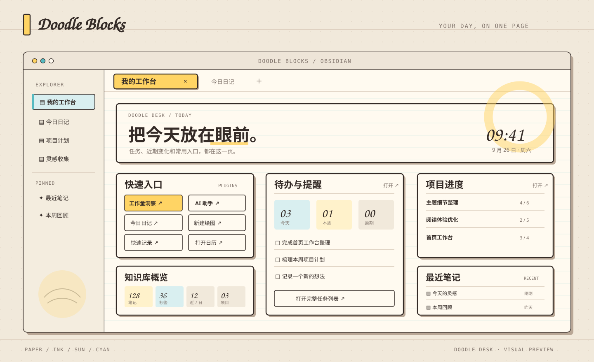

<h1 align="center">DOODLE BLOCKS</h1>

<p align="center">
  
</p>

<p align="center">
  <strong>把今天放在眼前，把想法留在纸上。</strong><br>
  为 Obsidian 默认主题准备的桌面端 CSS 片段与首页工作台
</p>

<p align="center">
  <kbd>DESKTOP</kbd> <kbd>LIGHT / DARK</kbd> <kbd>CSS SNIPPETS</kbd> <kbd>NO BUILD</kbd>
</p>

<p align="center">
  <a href="#快速安装">快速安装</a> &nbsp;|&nbsp; <a href="#按功能安装插件">插件选择</a> &nbsp;|&nbsp; <a href="#项目组成">项目组成</a> &nbsp;|&nbsp; <a href="#感谢与反馈">反馈</a>
</p>

<p align="center">
  
</p>

<p align="center"><sub>工作台视觉示意，画面中的笔记与数据均为示例</sub></p>

## 快速安装

### 只装主题样式

1. 在 Obsidian「设置 → 外观」中选择**默认主题**。
2. 下载 [`doodle-blocks.css`](snippets/doodle-blocks.css)，放入目标 Vault 的 `.obsidian/snippets/` 目录。
3. 在「设置 → 外观 → CSS 样式代码片段」刷新列表，启用 `doodle-blocks`。

完成后即可看到 Doodle Blocks 的工作区、笔记、代码块、新标签页和原生控件。无需 npm 或构建。

### 按功能安装插件

**只使用主题样式不需要安装插件。** 要在 Obsidian 中调配色，或把工作台设为启动页，再按功能安装：

| 插件 | 什么时候安装 |
| --- | --- |
| [Style Settings](https://community.obsidian.md/plugins/obsidian-style-settings) | 想在设置页调整纸面、墨色、黄色、青色与控件触感时安装。**推荐，可选。** |
| [Homepage](https://community.obsidian.md/plugins/homepage) | 想在启动 Obsidian 时自动打开工作台时安装。**工作台必需。** |
| [Dataview](https://community.obsidian.md/plugins/dataview) | 想让工作台读取任务与 Vault 数据时安装。**工作台必需。** |

在 Obsidian 中打开「设置 → 第三方插件（Community plugins）」，开启第三方插件后点击「浏览（Browse）」。搜索上表中的名称，依次点击「安装（Install）」和「启用（Enable）」。已安装的插件可直接在列表中启用。详见 [Obsidian 官方安装说明](https://obsidian.md/help/community-plugins)。

使用工作台时，还需在「设置 → Dataview」启用 **Enable JavaScript queries**。启用主题片段后，可在「Style Settings → Doodle Blocks」修改外观。

### 添加字体与工作台

**手写字体**：将 [`doodle-blocks-fonts.css`](snippets/doodle-blocks-fonts.css) 放入 `.obsidian/snippets/` 并启用 `doodle-blocks-fonts`。它只影响短标题和标签，正文与代码仍使用 Obsidian 的字体设置。

**首页工作台**：先启用 Homepage 和 Dataview，再按顺序完成：

1. 将[工作台笔记](homepage/Doodle%20Blocks%20工作台.md)复制到 Vault 根目录。
2. 将 [`doodle-blocks-homepage.css`](snippets/doodle-blocks-homepage.css) 放入 `.obsidian/snippets/` 并启用。
3. 在 Homepage 中选择「File → Doodle Blocks 工作台」，打开 **Open on startup**，视图选 **Reading view**。

<details>
<summary>按需开启工作台的更多快捷入口</summary>

- **任务与项目**：Tasks 打开完整任务列表；dotpm 显示项目进度；Project Manager Insights 提供工作量洞察，并依赖 dotpm。
- **记录与日历**：QuickAdd 用于快速记录，需先配置 Choice；Calendar 打开日历；「今日日记」使用 Obsidian 自带的「日记」核心插件。
- **绘图与 AI**：Excalidraw 新建绘图；Claudian 打开 AI 助手。

这些插件只影响对应入口，主题样式不依赖它们。

</details>

### 交给 Agent 安装

如果你的 Agent 可以访问本仓库和 Obsidian，复制以下指令并替换 Vault 占位符：

<details>
<summary>展开完整安装指令</summary>

```text
请把当前仓库的 Doodle Blocks 完整安装到我的 Obsidian 桌面端 Vault：<Vault 名称或绝对路径>。先确认目标 Vault；若无法唯一确定，向我询问。

阅读 README.md 和交付文件后：
1. 将 Obsidian 设为默认主题；复制并启用 snippets/ 下的 doodle-blocks.css、doodle-blocks-fonts.css、doodle-blocks-homepage.css。
2. 安装并启用 Style Settings、Homepage 和 Dataview，在 Dataview 中启用 JavaScript 查询。把 homepage/Doodle Blocks 工作台.md 放到 Vault 根目录，并在 Homepage 中设置为启动文件和 Reading view。
3. 保留 Vault 中其他笔记、片段和插件配置。同名交付文件已有自定义内容时，先比较并备份，再合并修改；不要直接覆盖。核对工作台的可选插件入口，列出缺失的插件。
4. 在真实 Obsidian 中检查浅色与深色外观、代码块、字体、Style Settings、工作台数据和按钮。报告安装位置、启用状态、改动与验收结果；无法完成的项目说明原因和需要我操作的步骤。
```

</details>

## 项目组成

Doodle Blocks 用奶油纸面、墨线边框、黄色活动状态和青色选中框构成一套连续的视觉语言。三个交付部分各自有明确用途：

| 部分与文件 | 用途 |
| --- | --- |
| **主题样式**<br>[`doodle-blocks.css`](snippets/doodle-blocks.css) | 浅深色工作区、纸签标签、笔记排版、代码块、新标签页与原生控件。可单独使用。 |
| **手写字体**<br>[`doodle-blocks-fonts.css`](snippets/doodle-blocks-fonts.css) | 离线的中英手写标题字体；不改变正文或代码字体。 |
| **首页工作台**<br>[工作台笔记](homepage/Doodle%20Blocks%20工作台.md) + [专用样式](snippets/doodle-blocks-homepage.css) | 今日总览、快速入口、待办与提醒、项目进度、知识库概览、最近笔记和本周日记。 |

工作台从当前 Vault 读取笔记与任务数据，按钮调用已安装插件的 Obsidian 命令。未安装对应的可选插件时，入口会禁用或给出提示；只安装主题样式时，无需 Homepage 或 Dataview。

## 使用与兼容

- **适配范围**：Obsidian 桌面端默认主题，支持浅色与深色模式。
- **更新与撤销**：替换相应 CSS 文件并刷新代码片段列表；停用片段即可撤销外观。
- **授权**：项目采用 [MIT 许可证](LICENSE)。内嵌字体的来源与授权见 [SOURCES.md](snippets/fonts/SOURCES.md)。

## 感谢与反馈

感谢你的使用与支持。发现问题或有改进建议，欢迎[提交 Issue](https://github.com/CoffeeCheese/obsidian-doodle-blocks/issues)。
